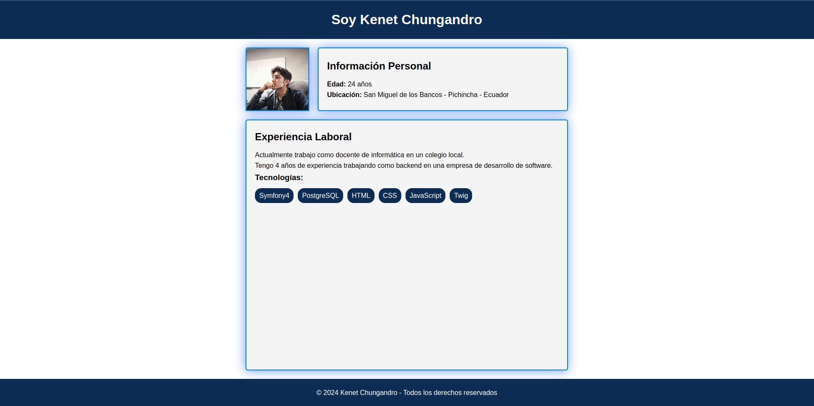
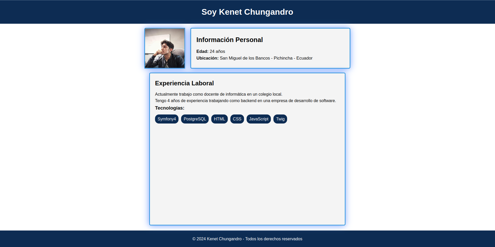
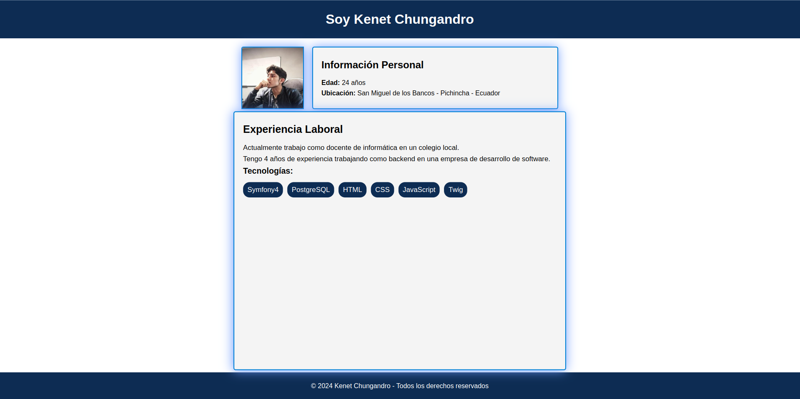

# Hoja de Vida Interactiva

Este es un proyecto de una hoja de vida interactiva que muestra la información personal y la experiencia laboral de Kenet Chungandro. La página web utiliza HTML, CSS y JavaScript para crear una interfaz moderna y atractiva.

## Vista Previa

## Características

- Sección de información personal con foto de perfil.
- Sección de experiencia laboral con tecnologías utilizadas.
- Interacción: las secciones se expanden ligeramente al pasar el mouse sobre ellas.

## Contenido del Proyecto

El proyecto contiene los siguientes archivos:

- `index.html`: Archivo HTML que define la estructura de la página.
- `index.css`: Archivo CSS que proporciona estilos para la página.
- `index.js`: Archivo JavaScript que añade interactividad a la página.

## Uso

Para visualizar la hoja de vida interactiva, simplemente abre el archivo `index.html` en tu navegador web.

## Personalización

Si deseas personalizar la hoja de vida con tu propia información, puedes editar el contenido en el archivo `index.html` y ajustar los estilos en el archivo `index.css`.

## Créditos

Este proyecto fue creado por [Kenet Chungandro](https://github.com/KenetAndres-gitHub) como parte de una práctica de desarrollo web.
